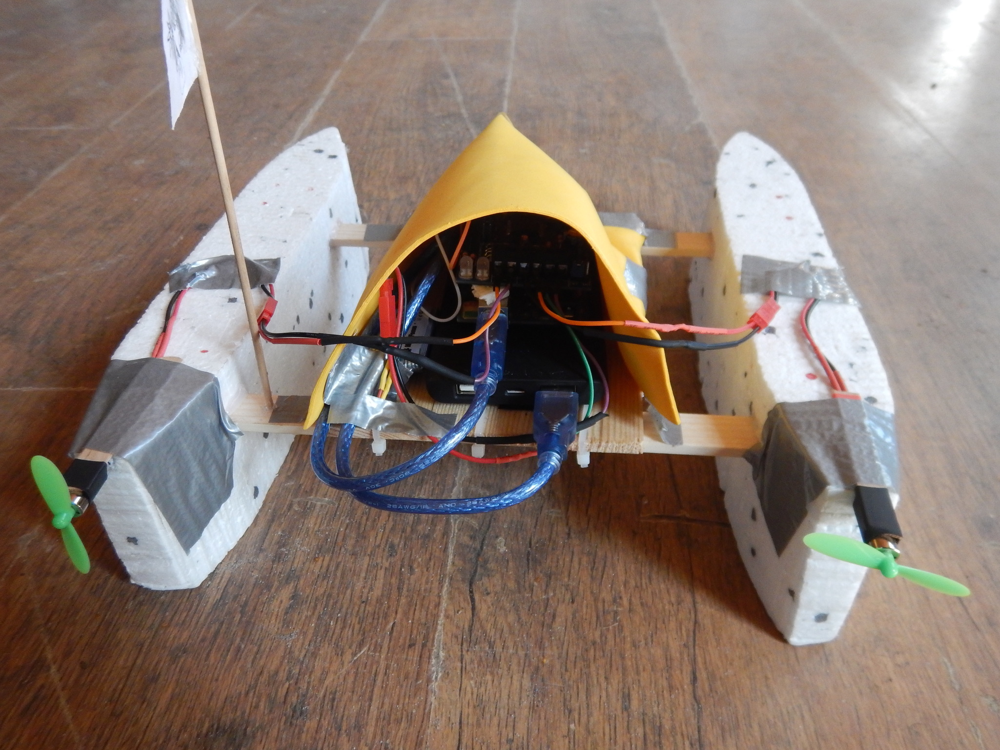
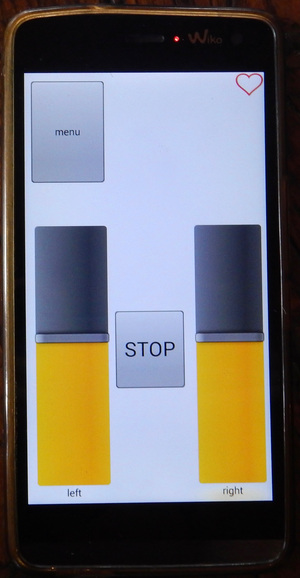
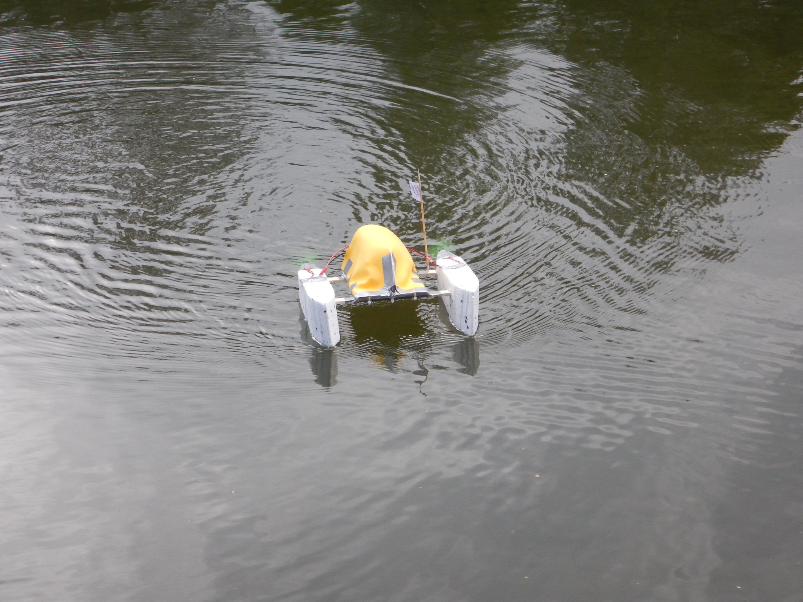

# airboat

A program to remotely control an Arduino-based boat written in C++.

- `rc` contains the code itself.
- `media` contains footage and images of an example design.

Extra features:

- Automatic motor deactivation when connection with remote control is lost.
- Reversible motors for improved manoeuvrability.

## Design and hardware

`rc` is designed to work with a rudderless double propeller design, and it is
recommended to space the propellers out to facilitate turning the boat. An
H-bridge is required for motor reversal to function.

`rc` is only tested on the Arduino Nano, but should work on other models.

## Software configuration

*Pin numbers mentioned below are set by default, but may be changed by the user
before compilation.*

`rc` must be compiled to the Arduino with the Arduino IDE.

`rc` functions with Bluetooth or WiFi, on pins 2 and 3 for RX and TX
respectively.

The right motor is powered by pin 10 and controlled by pin 12; the left motor is
powered by pin 6 and controlled by pin 4.

**Anything else is left to user preference.**

## Controller configuration

`rc` is controlled from [RoboRemo](https://www.roboremo.app/) on Android using 2
sliders, a heartbeat, and an optional stop button (recommended). RoboRemo inputs
send text such as "y xxx" or "y", where y is a number 0...9 and xxx a number
0..255.

The heartbeat must be configured to send a ping every 250 milliseconds with ID
3. If used, the stop button must be configured with to use ID 2.

Both sliders must send a number 0...255 with ID 0 for the left slider and ID 1
for the right slider.

**It is recommended to configure inputs to send on press instead of on
release.**

## Usage

The motors are stopped when the sliders are in the middle position, reversed
when below and spinning normally when above. It is possible to rapidly turn the
boat by simultaneously reversing one engine and powering the other.

Use the stop button when necessary to avoid losing control of the boat.

## License

Subject to the MIT license. See `LICENSE.txt` for more information.
